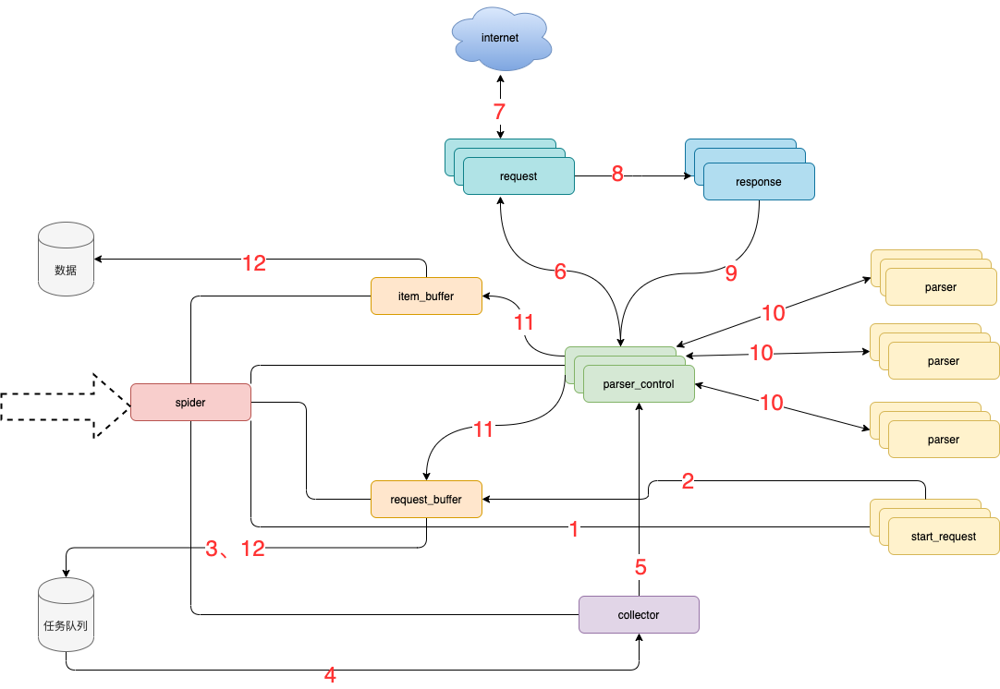
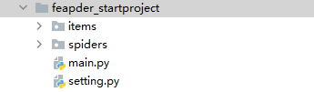

# FEAPDER框架

**学习目标**

- 掌握便捷式框架操作流程
- 掌握请求钩子结构使用
- 掌握框架项目搭建流程
- 掌握数据入库与去重


## 一、简介

**feapder** 是一款上手简单，功能强大的Python爬虫框架，使用方式类似`scrapy`，方便由`scrapy`框架切换过来，框架内置3种爬虫：

### 1、支持的场景

- `AirSpider`爬虫比较轻量，学习成本低。面对一些数据量较少，无需断点续爬，无需分布式采集的需求，可采用此爬虫。
- `Spider`是一款基于`redis`的分布式爬虫，适用于海量数据采集，支持断点续爬、爬虫报警、数据自动入库等功能
- `BatchSpider`是一款分布式批次爬虫，对于需要周期性采集的数据，优先考虑使用本爬虫。

**文档地址**

- 国内文档：[https://boris-code.gitee.io/feapder](https://boris-code.gitee.io/feapder)

### 2、环境要求

- Python 3.6.0+
- Works on Linux, Windows, macOS

**安装**

```
pip3 install feapder
```

### 3、框架设计



#### 3.1 模块说明：

- spider **框架调度核心**
- parser_control **模版控制器**，负责调度parser
- collector **任务收集器**，负责从任务队里中批量取任务到内存，以减少爬虫对任务队列数据库的访问频率及并发量
- parser **数据解析器**
- start_request 初始任务下发函数
- item_buffer **数据缓冲队列**，批量将数据存储到数据库中
- request_buffer **请求任务缓冲队列**，批量将请求任务存储到任务队列中
- request **数据下载器**，封装了requests，用于从互联网上下载数据
- response **请求响应**，封装了response, 支持xpath、css、re等解析方式，自动处理中文乱码

#### 3.2 流程说明：

1. spider调度**start_request**生产任务
2. **start_request**下发任务到request_buffer中
3. spider调度**request_buffer**批量将任务存储到任务队列数据库中
4. spider调度**collector**从任务队列中批量获取任务到内存队列
5. spider调度**parser_control**从collector的内存队列中获取任务
6. **parser_control**调度**request**请求数据
7. **request**请求与下载数据
8. request将下载后的数据给**response**，进一步封装
9. 将封装好的**response**返回给**parser_control**（图示为多个parser_control，表示多线程）
10. parser_control调度对应的**parser**，解析返回的response（图示多组parser表示不同的网站解析器）
11. parser_control将parser解析到的数据item及新产生的request分发到**item_buffer**与**request_buffer**
12. spider调度**item_buffer**与**request_buffer**将数据批量入库


## 二、使用方式

### 1、AirSpider使用

#### 1.1 创建项目

```python
feapder create -s douban 
```


#### 1.2 代码详解

默认生成的代码继承了feapder.AirSpider，包含 `start_requests` 及 `parser` 两个函数，含义如下：

1. feapder.AirSpider：轻量爬虫基类
2. start_requests：初始任务下发入口
3. feapder.Request：基于requests库类似，表示一个请求，支持requests所有参数，
4. parser：数据解析函数
5. response：请求响应的返回体，支持xpath、re、css等解析方式，详情可参考[Response](https://boris-code.gitee.io/feapder/#/source_code/Response)

除了start_requests、parser两个函数,系统还内置了下载中间件等函数。


#### 1.3 使用案例

```python
import feapder


class Douban(feapder.AirSpider):
    __custom_setting__ = dict(
        REQUEST_FILTER_ENABLE=True,  # request 去重
        REQUEST_FILTER_SETTING=dict(
            filter_type=4,  # 永久去重（BloomFilter） = 1 、内存去重（MemoryFilter） = 2、 临时去重（ExpireFilter）= 3、 轻量去重（LiteFilter）= 4
        ),
    )

    def start_requests(self):
        for i in range(11):
            yield feapder.Request(f"https://movie.douban.com/top250?start={i*25}&filter=")

    def parse(self, request, response):
        li_list = response.xpath('//ol/li/div[@class="item"]')
        # print(response.text)

        for li in li_list:
            item = {}
            item['title'] = li.xpath('./div[@class="info"]/div/a/span[1]/text()').extract_first()
            item['detail_url'] = li.xpath('./div[@class="info"]/div/a/@href').extract_first()
            item['score'] = li.xpath('.//div[@class="star"]/span[2]/text()').extract_first()
            yield feapder.Request(item['detail_url'], callback=self.parser_detail, item=item)

    def parser_detail(self, request, response):
        item = request.item
        if response.xpath('//div[@class="indent"]/span[@class="all hidden"]//text()'):
            item['detail_text'] = response.xpath('//div[@class="indent"]/span[@class="all hidden"]//text()').extract_first().strip()
        else:
            item['detail_text'] = response.xpath('//div[@class="indent"]/span[1]//text()').extract_first().strip()
        print(item)

if __name__ == "__main__":
    Douban(thread_count=5).start()
```


#### 1.4 数据入库

`feapder`给我们提供了方法`MysqlDB`

- 参考：https://feapder.com/#/source_code/MysqlDB

```python
from feapder.db.mysqldb import MysqlDB

db = MysqlDB(
    ip="localhost", port=3306, db="spiders", user_name="root", user_pass="root"
)

sql = '''
CREATE TABLE IF NOT EXISTS douban(
    id int primary key auto_increment not null,
    title VARCHAR(255) NOT NULL, 
    score VARCHAR(255) NOT NULL, 
    detail_text TEXT)
'''
db.execute(sql)
sql1 = "insert ignore into douban (id,title, score, detail_text) values ('%s', '%s','%s', '%s')" % (
0, '爱情动作片', '10', '爱情动作商业片')
db.add(sql1)
```


#### 1.5 创建配置文件

```
feapder create --setting
```

##### 1.5.1 激活配置

```python
# MYSQL
MYSQL_IP = "localhost"
MYSQL_PORT = 3306
MYSQL_DB = "spiders"
MYSQL_USER_NAME = "root"
MYSQL_USER_PASS = "root"
```

##### 1.5.2 创建item文件 

```
feapder create -i douban     # douban=表名
```

```python
from feapder import Item


class DoubanItem(Item):
    """
    This class was generated by feapder
    command: feapder create -i douban
    """

    __table_name__ = "douban"

    def __init__(self, *args, **kwargs):
        # self.id = None
        self.title = None
        self.score = None
        self.detail_text = None
```


##### 1.5.3 项目引入

```python
from douban_item import DoubanItem
def parse(self, request, response):
    li_list = response.xpath('//ol/li/div[@class="item"]')
    # print(response.text)

    for li in li_list:
        item = DoubanItem()
        item['title'] = li.xpath('./div[@class="info"]/div/a/span[1]/text()').extract_first()

        item['score'] = li.xpath('.//div[@class="star"]/span[2]/text()').extract_first()
        detail_url = li.xpath('./div[@class="info"]/div/a/@href').extract_first()
        yield feapder.Request(detail_url, callback=self.parser_detail, item1=item)

def parser_detail(self, request, response):
    item = request.item1
    if response.xpath('//div[@class="indent"]/span[@class="all hidden"]//text()'):
        item['detail_text'] = response.xpath(
            '//div[@class="indent"]/span[@class="all hidden"]//text()').extract_first().strip()
    else:
        item['detail_text'] = response.xpath('//div[@class="indent"]/span[1]//text()').extract_first().strip()
    yield item
```

#### 1.6下载器中间件

- 下载中间件用于在请求之前，对请求做一些处理，如添加cookie、header等
- 默认所有的解析函数在请求之前都会经过此下载中间件

```Python
def start_requests(self):
    for i in range(1):
        yield feapder.Request(f"https://movie.douban.com/top250?start={i * 25}&filter=", download_midware=self.download_midware)

def download_midware(self, request):
    request.headers = {
        'aa': 'baichuan'
    }
    request.proxies = {
        "http": "http://xxx.xxx.xxx.xxx:xxxx"
    }
    return request

def parse(self, request, response):
    print(response.headers)
```

#### 1.7自定义下载中间件

- 与自定义解析函数类似，下载中间件也支持自定义，只需要在feapder.Request参数里指定个`download_midware`回调即可，写法如下：
- 自定义的下载中间件只有指定的请求才会经过。其他未指定下载中间件的请求，还是会经过默认的下载中间件

```python
    def start_requests(self):
        # for i in range(11):
            yield feapder.Request(f"https://movie.douban.com/top250?start={1 * 25}&filter=", download_midware=self.custom_download_midware)

    def custom_download_midware(self, request):
        request.headers = {'bb': '11111'}
        return request
```

#### 1.8 校验

- feapder框架给到一个方法`validate`用来检验返回的数据是否正常
- 框架支持重试机制，下载失败或解析函数抛出异常会自动重试 请求。
- 默认最大重试次数为100次，我们可以引入配置文件或自定义配置来修改重试次数

```python
import feapder


class DoubanDemo(feapder.AirSpider):
    def start_requests(self):
        # for i in range(11):
        yield feapder.Request(f"https://movie.douban.com/top250?start={1 * 25}&filter=")


    def parse(self, request, response):
        pass

    def validate(self, request, response):
        print(response.status_code)
        if response.status_code != 200:
            raise Exception("response code not 200")


if __name__ == "__main__":
    DoubanDemo().start()
```


### 2、浏览器渲染下载

- 采集动态页面时（Ajax渲染的页面），常用的有两种方案。一种是找接口拼参数，这种方式比较复杂但效率高，需要一定的爬虫功底；另外一种是采用浏览器渲染的方式，直接获取源码，简单方便
- 内置浏览器渲染支持 **CHROME** 、**PHANTOMJS**、**FIREFOX**
- 在返回的Request中传递`render=True`即可

```python
def start_requests(self):
    yield feapder.Request("https://news.qq.com/", render=True)
```

#### 2.1 配置自动化

- 在setting里面改配置
- 在项目里面重写配置

```python
__custom_setting__ = dict(
    pool_size=1,  # 浏览器的数量
    load_images=True,  # 是否加载图片
    user_agent=None,  # 字符串 或 无参函数，返回值为user_agent
    proxy=None,  # xxx.xxx.xxx.xxx:xxxx 或 无参函数，返回值为代理地址
    headless=False,  # 是否为无头浏览器
    driver_type="CHROME",  # CHROME、PHANTOMJS、FIREFOX
    timeout=30,  # 请求超时时间
    window_size=(1024, 800),  # 窗口大小
    # 不给指定路径会出现编码问题 
    executable_path='D:\software\miniconda3\chromedriver.exe',  # 浏览器路径，默认为默认路径
    render_time=0,  # 渲染时长，即打开网页等待指定时间后再获取源码
    custom_argument=[
        "--ignore-certificate-errors",
        "--disable-blink-features=AutomationControlled",
    ],  # 自定义浏览器渲染参数
    xhr_url_regexes=None,  # 拦截xhr接口，支持正则，数组类型
    # 即浏览器渲染相关配置 auto_install_driver 设置True，让其自动对比驱动版本，版本不符或驱动不存在时自动下载
    auto_install_driver=True,  # 自动下载浏览器驱动 支持chrome 和 firefox
    download_path=None,  # 下载文件的路径
    use_stealth_js=False,  # 使用stealth.min.js隐藏浏览器特征
)
```

#### 2.2 基本使用

```python
import time

import feapder
from feapder.utils.webdriver import WebDriver
from selenium.webdriver.common.by import By

class TestRender(feapder.AirSpider):
    def start_requests(self):
        yield feapder.Request("http://www.baidu.com", render=True)

    def parse(self, request, response):
        browser: WebDriver = response.browser
        browser.find_element(By.ID, "kw").send_keys("feapder")
        browser.find_element(By.ID, "su").click()
        print(browser.page_source)


if __name__ == "__main__":
    TestRender().start()
```

#### 2.3 拦截xhr数据

```python
WEBDRIVER = dict(
    ...
    xhr_url_regexes=[
        "接口1正则",
        "接口2正则",
    ]
)
```

#### 2.4 数据获取

```python
browser: WebDriver = response.browser
# 提取文本
text = browser.xhr_text("接口1正则")
# 提取json
data = browser.xhr_json("接口1正则")
```

#### 2.5 获取对象

```python
browser: WebDriver = response.browser
xhr_response = browser.xhr_response("接口1正则")
print("请求接口", xhr_response.request.url)
print("请求头", xhr_response.request.headers)
print("请求体", xhr_response.request.data)
print("返回头", xhr_response.headers)
print("返回地址", xhr_response.url)
print("返回内容", xhr_response.content)
```

#### 2.6 实例代码

- 配置文件

```Python
WEBDRIVER = dict(
    pool_size=1,  # 浏览器的数量
    load_images=True,  # 是否加载图片
    user_agent=None,  # 字符串 或 无参函数，返回值为user_agent
    proxy=None,  # xxx.xxx.xxx.xxx:xxxx 或 无参函数，返回值为代理地址
    headless=False,  # 是否为无头浏览器
    driver_type="CHROME",  # CHROME、PHANTOMJS、FIREFOX
    timeout=30,  # 请求超时时间
    window_size=(1024, 800),  # 窗口大小
    executable_path='D:\software\miniconda3\chromedriver.exe',  # 浏览器路径，默认为默认路径
    render_time=0,  # 渲染时长，即打开网页等待指定时间后再获取源码
    custom_argument=[
        "--ignore-certificate-errors",
        "--disable-blink-features=AutomationControlled",
    ],  # 自定义浏览器渲染参数
    xhr_url_regexes=['open/noauth/job/search'],  # 拦截xhr接口，支持正则，数组类型
    auto_install_driver=True,  # 自动下载浏览器驱动 支持chrome 和 firefox
    download_path=None,  # 下载文件的路径
    use_stealth_js=False,  # 使用stealth.min.js隐藏浏览器特征
)
```


- 爬虫代码

```python
import feapder
from feapder.utils.webdriver import WebDriver
from selenium.webdriver.common.by import By
from selenium.webdriver.support.ui import WebDriverWait
from selenium.webdriver.support import expected_conditions as EC


class SpiderProject(feapder.AirSpider):
    def start_requests(self):
        yield feapder.Request("https://young.yingjiesheng.com/pc/search?jobarea=220200&keyword=Python", render=True)

    def parse(self, request, response):
        browser: WebDriver = response.browser
        wait = WebDriverWait(browser, 10)
        wait.until(EC.presence_of_element_located((By.XPATH, '//*[@id="list"]/div[1]/div[1]/div/div[1]/div[1]/div/div[1]')))
        data = browser.xhr_json('open/noauth/job/search')
        # print(data['resultbody']['searchData']['joblist'])
        for da in data['resultbody']['searchData']['joblist']['items']:
            item = {}
            item['jobname'] = da['jobname']
            item['coname'] = da['coname']
            item['jobarea'] = da['jobarea']
            item['issuedate'] = da['issuedate']
            item['jobtag'] = da['jobtag']
            item['providesalary'] = da['providesalary']
            print(item)


if __name__ == "__main__":
    SpiderProject().start()
```


## 三、项目实战

### 1、 创建项目

```python
feapder create -p <project_name>
feapder create -p feapder_startproject
```




- items： 文件夹存放与数据库表映射的item
- spiders： 文件夹存放爬虫脚本
- main.py： 运行入口
- setting.py： 爬虫配置文件 

### 2、创建爬虫文件

- 需要先切换到spiders文件夹下

```
feapder create -s jd_project
```

### 3、配置自动化

```python
WEBDRIVER = dict(
    pool_size=1,  # 浏览器的数量
    load_images=True,  # 是否加载图片
    user_agent=None,  # 字符串 或 无参函数，返回值为user_agent
    proxy=None,  # xxx.xxx.xxx.xxx:xxxx 或 无参函数，返回值为代理地址
    headless=False,  # 是否为无头浏览器
    driver_type="CHROME",  # CHROME、PHANTOMJS、FIREFOX
    timeout=30,  # 请求超时时间
    window_size=(1024, 800),  # 窗口大小
    executable_path='D:\software\miniconda3\chromedriver.exe',  # 浏览器路径，默认为默认路径
    render_time=0,  # 渲染时长，即打开网页等待指定时间后再获取源码
    custom_argument=[
        "--ignore-certificate-errors",
        "--disable-blink-features=AutomationControlled",
    ],  # 自定义浏览器渲染参数
    xhr_url_regexes=['open/noauth/job/search'],  # 拦截xhr接口，支持正则，数组类型
    auto_install_driver=True,  # 自动下载浏览器驱动 支持chrome 和 firefox
    download_path=None,  # 下载文件的路径
    use_stealth_js=False,  # 使用stealth.min.js隐藏浏览器特征
)
```

### 4、配置数据库创建item文件

#### 4.1配置数据库

```python
# MYSQL
MYSQL_IP = "localhost"
MYSQL_PORT = 3306
MYSQL_DB = "spiders"
MYSQL_USER_NAME = "root"
MYSQL_USER_PASS = "root"
```

#### 4.2创建数据库

```python
from feapder.db.mysqldb import MysqlDB
db = MysqlDB(
    ip="localhost", port=3306, db="spiders10", user_name="root", user_pass="root"
)
sql = """
CREATE TABLE `jd` (
  `id` int(11) NOT NULL AUTO_INCREMENT,
  `img` varchar(255) DEFAULT NULL,
  `price` varchar(255) DEFAULT NULL,
  `title` varchar(255) DEFAULT NULL,
  `info_url` varchar(255) DEFAULT NULL,
  PRIMARY KEY (`id`)
)
"""
db.execute(sql)
```

#### 4.3 创建item文件

进入到items文件

```
feapder create -i jd     # jd=数据库表名
```

### 5、项目源码

```python
# -*- coding: utf-8 -*-
"""
Created on 2023-03-19 22:02:02
---------
@summary:
---------
@author: 柏汌
"""
import random
import time
from lxml import etree

from items import jd_item
import feapder
from feapder.utils.webdriver import WebDriver
from selenium.webdriver.common.by import By
from selenium.webdriver.support.wait import WebDriverWait
from selenium.webdriver.support import expected_conditions as EC


class JdProject(feapder.AirSpider):
    def start_requests(self):
        yield feapder.Request("https://search.jd.com/Search?keyword=电脑", render=True)

    def parse(self, request, response):
        browser: WebDriver = response.browser
        self.roll_page(browser)
        res = browser.page_source
        # print(res)
        html = etree.HTML(res)
        info_list = html.xpath('//div[@id="J_goodsList"]/ul/li/div')
        for info in info_list:
            item = jd_item.JdItem()
            item['img'] = info.xpath('./div[@class="p-img"]/a/img/@src')[0]
            item['info_url'] = info.xpath('./div[@class="p-img"]/a/@href')[0]
            item['price'] = info.xpath('./div[@class="p-price"]/strong/i/text()')[0]
            item['title'] = ''.join(i.strip() for i in info.xpath('./div[@class="p-name p-name-type-2"]/a/em//text()'))
            print(item)
            yield item
        # 翻页提取
        self.click_page(browser)
        page_url = browser.current_url  # 获取点击的跳转链接
        print(page_url)
        yield feapder.Request(page_url, render=True, callback=self.parse)

    def click_page(self, browser):
        try:
            next_btn = browser.find_element(By.XPATH, './/a[@class="pn-next"]')
            if 'disabled' in next_btn.get_attribute('class'):
                print(f"没有下一页数据了，抓取完成")
                browser.close()
            else:
                next_btn.click()
        except Exception as e:
            print(e)

    def roll_page(self, browser):
        # document.body.scrollHeight查看页面高度
        for x in range(1, 11):
            time.sleep(int(random.randint(1000, 1200) / 1000))
            js = "window.scrollTo(0, {})".format(x * 1000)  # 1000 2000 3000 4000 5000
            browser.execute_script(js)


if __name__ == "__main__":
    JdProject().start()
```

